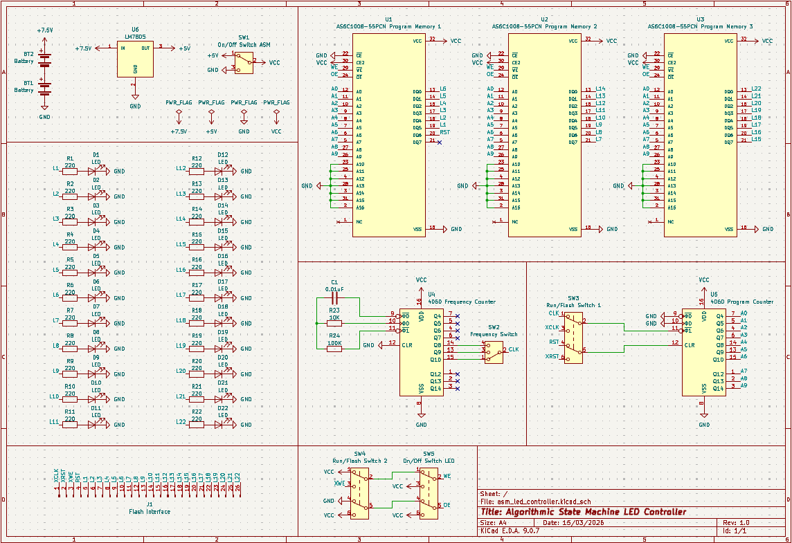
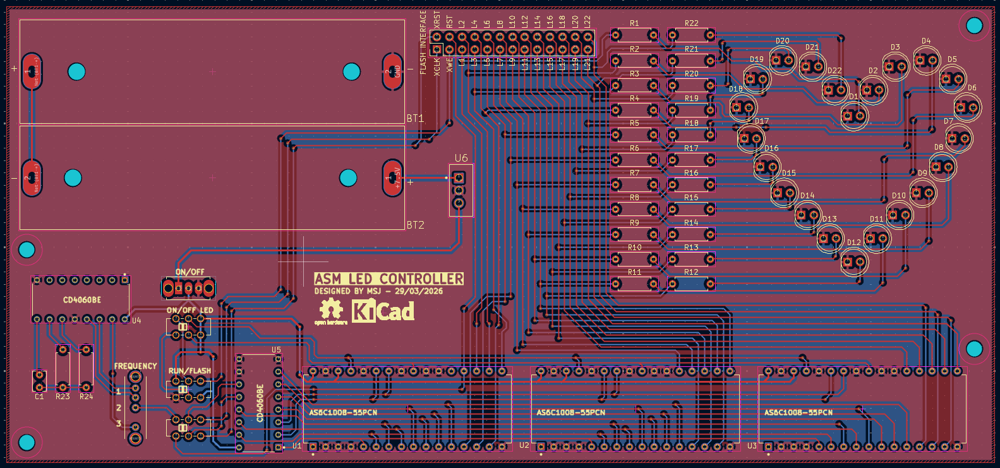

# ASM LED Controller

This repository contains the schematic and layout files for an algorithmic state machine that controls an array of LEDs.
The circuit makes use of AS6C1008-55PCN static RAM ICs to store a sequence of bits representing the pattern in which the
LEDs are supposed to light up. The different states of the LEDs are iterated through the means of CD4060BE binary counters.

