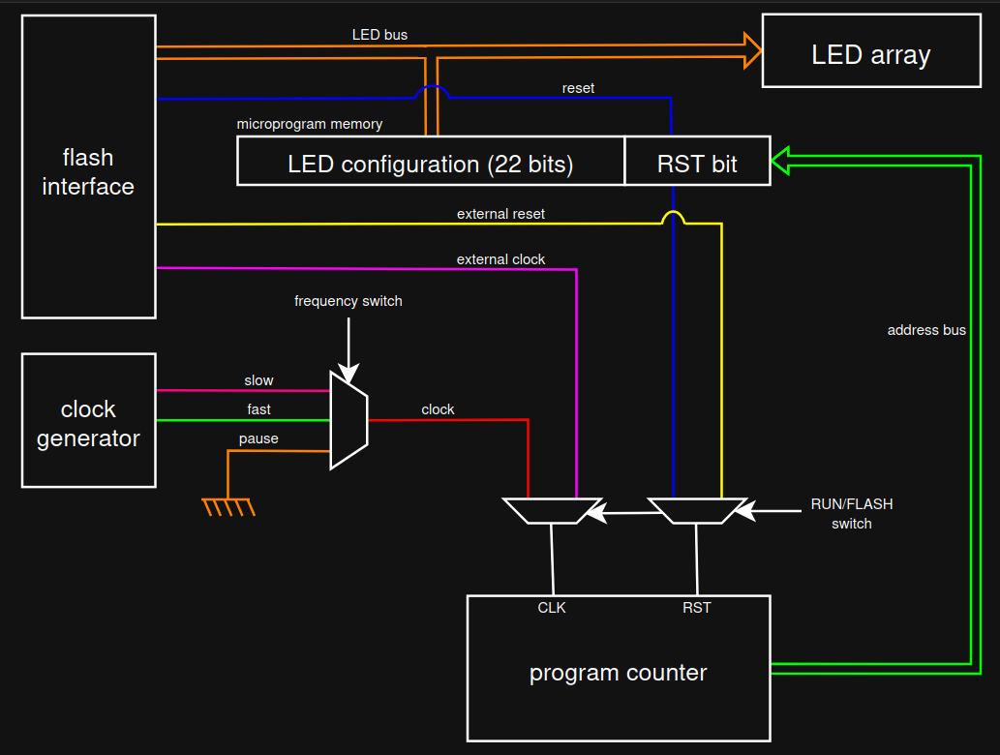

# ASM LED Controller

The ASM LED Controller Board is an algorithmic state machine, designed to store 
and run a microprogram which commands the state of the 22 LEDs that are part of 
the on-board, heart-shaped LED array.

## Features

- 22 individually addressable LEDs
- Microprograms up to 1023 microinstructions long
- 3 separate clock speeds
- Fully digital flash interface

## Schematic Overview

## Flashing

## Repository Contents

